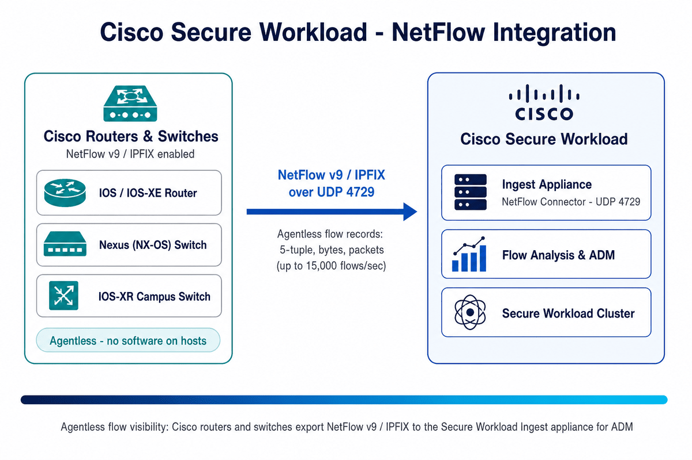

# Cisco Secure Workload → NetFlow Integration Guide

A step-by-step integration guide for **agentless flow ingestion** into Cisco Secure Workload (CSW) using **NetFlow v9 / IPFIX** exported by Cisco routers and switches to the **NetFlow connector** on a CSW **Ingest appliance** — the primary way to gain east-west flow visibility for workloads that can't run a CSW agent.

> **⚠ Disclaimer:** This is a **community reference guide** prepared by Cisco Solutions Engineering — not an official Cisco product document. Always refer to the [official Cisco Secure Workload documentation](https://www.cisco.com/c/en/us/support/security/tetration/series.html) and the [Compatibility Matrix](https://www.cisco.com/c/m/en_us/products/security/secure-workload-compatibility-matrix.html) for authoritative, up-to-date guidance.

---

## What This Covers

| Area | Detail |
|---|---|
| **Integration type** | **Agentless** flow ingestion — the **NetFlow connector** runs on a CSW **Ingest appliance** |
| **Sources** | Cisco **IOS / IOS-XE / IOS-XR / NX-OS** routers and switches exporting flows |
| **Protocols** | **NetFlow v9** and **IPFIX** (v5 is **not** supported) |
| **Transport** | UDP to the connector's listening port (**default 4729**; configurable via `update-listening-ports`) |
| **Capacity** | Up to **15,000 flows/second** per connector; excess is dropped |
| **Scope** | One **VRF** per connector (create additional connectors for more VRFs) |
| **Enforcement** | **None** — flow **visibility only**; NetFlow carries **no** process/host metadata |
| **Verified against** | CSW 4.x on-prem and SaaS |

---

## Quick Start

### Prerequisites
- Cisco device supporting **NetFlow v9 or IPFIX** (IOS/IOS-XE/IOS-XR/NX-OS), feature licensed & enabled
- Network reachability: device → CSW **Ingest appliance** on **UDP 4729** (or your configured port)
- A CSW **Ingest appliance** deployed with capacity for the expected flow rate
- **Agent Remote VRF Configuration** covering the monitored workloads' subnet(s)
- Firewall: UDP/4729 from the exporting devices → CSW Ingest appliance

### Steps (summary)

**On the Cisco device (Flexible NetFlow):**
1. Define a **flow record** (5-tuple + TCP flags + counters + interfaces)
2. Create a **flow exporter** → `destination <Ingest IP>`, `transport udp 4729`, `export-protocol netflow-v9`
3. Create a **flow monitor** binding record + exporter; apply to interfaces **input and output**
4. Verify with `show flow exporter … statistics`

**On Cisco Secure Workload:**
1. `Manage → Virtual Appliances` → select the **Ingest appliance**
2. **Connectors** → **+ Add Connector** → **NetFlow**; set the **Listening Port** (default 4729) to match the exporter
3. Add an **Agent Remote VRF Configuration** (VRF, subnet CIDR, port range `4729-4729`) → **Test and Apply**

**Verify:**
1. Connector shows **Status: Active**; on the appliance `tcpdump -i any -n port 4729` shows UDP from device IPs
2. `Observe → Traffic` — flows appear for the monitored subnets

See the [full step-by-step guide](CSW-NetFlow-Integration-Guide.md) or [open the HTML version](CSW-NetFlow-Integration-Guide.html) for detailed instructions.

---

## Video References

> **Legend:** 🎬 video · 📘 guide · 📄 doc

| Reference | What it shows |
|---|---|
| [🎬 CSW User Education video library](https://github.com/chandrapati/CSW-User-Education) | Curated Secure Workload concept explainers and walkthroughs |
| [📘 NetFlow Integration Guide](CSW-NetFlow-Integration-Guide.md) | This repo's full step-by-step deployment guide (IOS-XE + NX-OS configs) |
| [📄 Cisco docs — NetFlow Connector](https://www.cisco.com/c/en/us/td/docs/security/workload_security/secure_workload/user-guide/4_0/cisco-secure-workload-user-guide-on-prem-v40/configure-and-manage-connectors-for-secure-workload.html) | Authoritative connector behavior, supported IPFIX elements, and limits |

---

## Architecture Diagram

*Cisco routers and switches aggregate traffic into flows and export NetFlow v9 / IPFIX over UDP 4729 to the NetFlow connector on a CSW Ingest appliance, which forwards flow observations to the cluster for ADM and traffic visibility — no agent on the monitored hosts.*

---

## Files in This Repo

| File | Description |
|---|---|
| [`README.md`](README.md) | This file — quick start and overview |
| [`CSW-NetFlow-Integration-Guide.md`](CSW-NetFlow-Integration-Guide.md) | Full step-by-step guide (Markdown source) |
| [`CSW-NetFlow-Integration-Guide.html`](CSW-NetFlow-Integration-Guide.html) | Styled HTML — open in browser for best experience |
| [`csw-netflow-architecture.png`](csw-netflow-architecture.png) | Architecture diagram |
| [`build.sh`](build.sh) | Regenerate HTML from Markdown (requires pandoc) |

---

## Supported Elements — Quick Reference

Mandatory NetFlow v9 / IPFIX information elements the connector requires:

| Element (IPFIX ID) | Meaning |
|---|---|
| `sourceIPv4Address` (8) / `destinationIPv4Address` (12) | Source / destination IP |
| `sourceTransportPort` (7) / `destinationTransportPort` (11) | Source / destination port |
| `protocolIdentifier` (4) | IP protocol |
| `octetDeltaCount` (1) / `packetDeltaCount` (2) | Bytes / packets |
| `flowStartSysUpTime` (22) / `flowEndSysUpTime` (21) | Flow start / end |
| `tcpControlBits` (6), `ingressInterface` (10), `egressInterface` (14) | Recommended |

> **Important:** NetFlow provides **flow data only** — to add workload context, pair it with **CSW agents** or **ServiceNow/label** enrichment. Keep the flow rate **≤ 15,000/sec** per connector (increase sampling or add an Ingest appliance if exceeded). **v5 is not supported**; use **v9 or IPFIX**.

---

## Step-by-Step Guides

> **Legend:** 🎬 video · 📘 guide · 📄 doc

Hands-on integration and deployment guides — follow these top to bottom to build out a deployment:

| Guide | Description | Best for |
|-------|-------------|---------|
| [📘 Agent Installation](https://github.com/chandrapati/CSW-Agent-Installation-Guide) | Deploy CSW agents on Linux / Windows / cloud | Day-1 sensor deployment |
| [📘 Policy Lifecycle](https://github.com/chandrapati/CSW-Policy-Lifecycle) | Policy discovery → enforcement workflow | Policy management |
| [📘 ISE / pxGrid](https://github.com/chandrapati/csw-ise-integration) | ISE/pxGrid: user-identity–aware microsegmentation | Identity & Zero Trust |
| [📘 AnyConnect NVM](https://github.com/chandrapati/csw-anyconnect-nvm) | Endpoint process flows + user identity via NVM | Endpoint telemetry |
| [📘 ServiceNow CMDB](https://github.com/chandrapati/csw-servicenow-integration) | ServiceNow CMDB label enrichment for workload scopes | CMDB-driven policy |
| [📘 Infoblox](https://github.com/chandrapati/csw-infoblox-integration) | Infoblox IPAM/DNS extensible-attribute label enrichment | IPAM/DNS-driven policy |
| [📘 F5 BIG-IP](https://github.com/chandrapati/csw-f5-integration) | F5 virtual-server labels, policy enforcement, IPFIX flow visibility | Load balancer segmentation |
| [📘 NetScaler ADC](https://github.com/chandrapati/csw-netscaler-integration) | NetScaler LB virtual-server labels, ACL enforcement + AppFlow/IPFIX flow visibility | Load balancer segmentation |
| [📘 AWS Connector](https://github.com/chandrapati/csw-aws-connector) | EC2 tag ingestion + VPC flow logs + Security Group enforcement | AWS workloads |
| [📘 Azure Connector](https://github.com/chandrapati/csw-azure-connector) | Azure VM tag ingestion + VNet flow logs + NSG enforcement | Azure workloads |
| [📘 GCP Connector](https://github.com/chandrapati/csw-gcp-connector) | GCE label ingestion + VPC flow logs + firewall enforcement | GCP workloads |
| [📘 NetFlow](https://github.com/chandrapati/csw-netflow-integration) | NetFlow v9/IPFIX agentless flow ingestion from switches | Network fabric visibility |
| [📘 ERSPAN](https://github.com/chandrapati/csw-erspan-integration) | Agentless packet mirroring for legacy / OT / IoT devices | Deep agentless visibility |
| [📘 Secure Firewall](https://github.com/chandrapati/CSW-Secure-Firewall-Integration-Guide) | NSEL flow ingestion from Cisco Secure Firewall (FTD/ASA) | Firewall flow visibility |
| [📘 Splunk Integration](https://github.com/chandrapati/csw-splunk-integration) | CSW syslog alerts → Splunk SIEM | SecOps / SIEM teams |

## Resources

> **Legend:** 🎬 video · 📘 guide · 📄 doc

Learning paths, reference material, and day-2 tooling:

| Resource | Description | Best for |
|----------|-------------|---------|
| [📘 User Education](https://github.com/chandrapati/CSW-User-Education) | Onboarding guides, concept explainers, and curated video library | New CSW users |
| [📘 Compliance Mapping](https://github.com/chandrapati/CSW-Compliance-Mapping) | Map CSW controls to NIST, PCI-DSS, HIPAA, CIS | Compliance & audit |
| [📘 Tenant Insights](https://github.com/chandrapati/CSW-Tenant-Insights) | Tenant-level reporting and analytics | Visibility metrics |
| [📘 Operations Toolkit](https://github.com/chandrapati/CSW-Operations-Toolkit) | Day-2 ops scripts: health checks, reporting, policy analysis | Ongoing operations |
| [📄 Supported OS & Compatibility Matrix](https://www.cisco.com/c/m/en_us/products/security/secure-workload-compatibility-matrix.html) | Cisco's authoritative list of supported agent operating systems, external systems, and connector requirements | Platform planning & prerequisites |

> **Suggested customer journey:**
> User Education → Agent Installation → Policy Lifecycle → ISE/pxGrid → ServiceNow CMDB → Infoblox → F5 BIG-IP → NetScaler ADC → Splunk Integration → Compliance Mapping → Operations Toolkit
